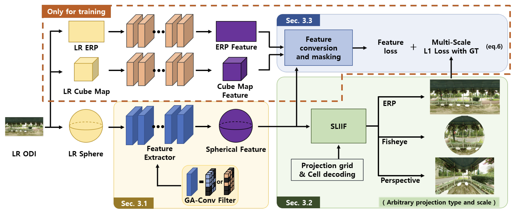

## [CVPR 2022-Oral] SphereSR: 360◦ Image Super-Resolution with Arbitrary Projection via Continuous Spherical Image Representation <br><sub>Official PyTorch Implementation </sub>

[Paper](https://openaccess.thecvf.com/content/CVPR2022/papers/Yoon_SphereSR_360deg_Image_Super-Resolution_With_Arbitrary_Projection_via_Continuous_Spherical_CVPR_2022_paper.pdf)

## Introduction

The 360deg imaging has recently gained much attention; however, its angular resolution is relatively lower than that of a narrow field-of-view (FOV) perspective image as it is captured using a fisheye lens with the same sensor size. Therefore, it is beneficial to super-resolve a 360deg image. Several attempts have been made, but mostly considered equirectangular projection (ERP) as one of the ways for 360deg image representation despite the latitude-dependent distortions. In that case, as the output high-resolution (HR) image is always in the same ERP format as the lowresolution (LR) input, additional information loss may occur when transforming the HR image to other projection types. In this paper, we propose SphereSR, a novel framework to generate a continuous spherical image representation from an LR 360deg image, with the goal of predicting the RGB values at given spherical coordinates for superresolution with an arbitrary 360deg image projection. Specifically, first we propose a feature extraction module that represents the spherical data based on an icosahedron and that efficiently extracts features on the spherical surface. We then propose a spherical local implicit image function (SLIIF) to predict RGB values at the spherical coordinates. As such, SphereSR flexibly reconstructs an HR image given an arbitrary projection type. Experiments on various benchmark datasets show that the proposed method significantly surpasses existing methods in terms of performance.

### Framework


# Citation

If you find this project helpful in your research, welcome to cite the paper.

```
@InProceedings{Yoon_2022_CVPR,
    author    = {Yoon, Youngho and Chung, Inchul and Wang, Lin and Yoon, Kuk-Jin},
    title     = {SphereSR: 360deg Image Super-Resolution With Arbitrary Projection via Continuous Spherical Image Representation},
    booktitle = {Proceedings of the IEEE/CVF Conference on Computer Vision and Pattern Recognition (CVPR)},
    month     = {June},
    year      = {2022},
    pages     = {5677-5686}
}
```

# Contact

Please contact Youngho Yoon if there is any question (dudgh1732@kaist.ac.kr).
